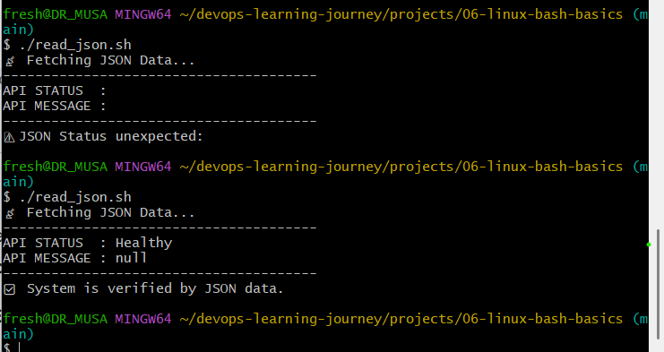

# 🚀 DevOps Learning Journey

> A documented journey from beginner to DevOps engineer - building real tools, one concept at a time.

[](https://github.com/dr-musa-bala)
[](https://github.com/dr-musa-bala/devops-learning-journey)

## 👋 About This Journey

I'm learning DevOps by building real automation tools and documenting everything I learn. This repository is my public learning log - tracking progress, sharing insights, and building in public.

**Start Date:** February 06, 2026  
**Current Day:** 1 of 100  
**Current Focus:** Go Programming Fundamentals

## 📊 Progress at a Glance

| Metric | Count |
|--------|-------|
| 🗓️ Days Learning | 1 |
| 🛠️ Projects Built | 2 |
| 📚 Concepts Learned | 5 |
| 💻 Lines of Code | 163 |
| 📝 Git Commits | 1 |

**Last Updated:** Feb 06, 2026

## 🛠️ Projects Built

### 0. [Hello World](./projects/00-hello-world) - Day 1
**What it does:** My first Go program  
**Key learning:** Go package system, build process, environment setup  
**Status:** ✅ Complete

### 1. [Automated File Organizer](./projects/02-file-organizer) - Day 1
**What it does:** Organizes files by type automatically  
**Key learning:** File I/O, pattern matching, categorization  
**Status:** ✅ Complete  
**Impact:** Reduced file organization time from 20 minutes to 2 seconds

## 📚 What I'm Learning

### Current Week (Week 1)
- [x] Go basics (variables, functions, types)
- [x] File system operations
- [x] Error handling patterns
- [ ] Docker fundamentals
- [ ] Git workflows

### This Month
- Build 4 automation tools in Go
- Learn Docker container management
- Understand CI/CD basics
- Set up GitHub Actions

## 🎯 Learning Goals

**Short-term (Month 1):**
- Master Go programming fundamentals
- Understand Docker and containers
- Learn basic Kubernetes concepts

**Long-term (6 Months):**
- Build production-ready DevOps tools
- Contribute to open-source projects
- Land a DevOps engineering role
- Help others on their DevOps journey

## 💡 Latest Insights

### Day 1 - Key Takeaway
> "Go compiles to standalone binaries with zero dependencies. This is a game-changer 
> for DevOps tools - no Python virtual environments, no Node.js modules, just one 
> executable that runs anywhere!"

[Read all daily insights →](./docs/learnings/)

## 🔧 Tech Stack

**Currently Learning:**
- Go 1.25+
- Git & GitHub
- VS Code
- Docker (upcoming)
- Kubernetes (upcoming)

**Development Environment:**
- OS: Windows 11
- Terminal: PowerShell, GitBash
- Editor: VS Code with Go extension

## 📖 How to Use This Repository

Each project includes:
- ✅ Complete, working source code
- ✅ Detailed README explaining what I learned
- ✅ Challenges faced and solutions found
- ✅ Time invested and metrics
- ✅ Next steps and future improvements

Feel free to:
- ⭐ Star this repo if you find it helpful
- 🔀 Fork it to start your own learning journey
- 💬 Open issues with questions or suggestions
- 🤝 Connect with me on [LinkedIn](www.linkedin.com/in/musa-bala-audu-o-d-57b906113/)

## 🌱 Why I'm Learning in Public

1. **Accountability** - Public commitment keeps me consistent
2. **Documentation** - Future me will thank present me
3. **Community** - Helping others who are on the same path
4. **Portfolio** - Evidence of continuous learning
5. **Growth** - Feedback makes me better

## 🔗 Connect With Me

- 💼 [LinkedIn](https://www.linkedin.com/in/musa-bala-audu-o-d-57b906113/) - Professional updates
- 🐦 [Twitter/X](@sight_musa) - Daily progress
- 📧 [Email](freshabdullaah@gmail.com) - Let's talk DevOps!

## 📈 Weekly Progress

### Week 1 (Jan 06-13, 2026)
- ✅ Set up Go development environment
- ✅ Built Hello World program
- ✅ Created file organizer tool
- 🔄 Learning Docker basics
- 📅 Planning first container project

## 🙏 Inspired By

- The #100DaysOfCode community
- #DevOps community on Twitter/LinkedIn
- Every developer who learns in public

---

**"The expert in anything was once a beginner."** - Helen Hayes


---

Last commit: Just getting started!  
Next milestone: 10 days of consistent learning
💪 Let's build something amazing, one day at a time.

## 🤖 CI/CD Automation
This repo is now automated! 

- **Workflow:** `.github/workflows/main.yml`
- **Docker Image:** `musabalaaudu/health-api:main`
- **Port Mapping:** `-p 8080:8080`

### Quick Commands
```bash
# Pull and Run the Cloud version
docker pull musabalaaudu/health-api:main
docker run -d -p 8080:8080 musabalaaudu/health-api:main

---

# 🚀 DevOps Journey: From Broken Pipelines to Containerized Excellence

## 📌 Project Overview

This project demonstrates a full CI/CD lifecycle for a Go-based Health API and its associated Bash automation tools. It covers the transition from local development to automated linting, containerization, and cross-environment networking.

---

## 🏗️ The Architecture

1. **Backend**: A Golang API providing system health metrics.
2. **Automation**: Bash scripts (`check_status.sh`, `read_json.sh`) for monitoring.
3. **CI/CD**: GitHub Actions utilizing `ShellCheck` for linting and Docker for image distribution.
4. **Containerization**: A multi-purpose Docker image used to run the automation suite.

---

## 🛠️ The "DevOps Trial by Fire": Debugging Log

### 1. The Invisible CI/CD Gatekeeper

**The Issue:** We integrated `ShellCheck` into `main.yml`, but the pipeline was passing even when the code was intentionally broken.
**The Discovery:** An indentation error in the YAML file caused the `ShellCheck` step to be ignored by GitHub Actions.
**The Fix:** We correctly aligned the steps, triggering the first successful "Build Failure"—a milestone in DevOps safety.

### 2. The Windows vs. Linux Showdown (`\r` Carriage Returns)

**The Error:** `SC1017: The parser reached the end of the file while looking for a corresponding 'done'.`
**The Culprit:** Windows uses `CRLF` (`\r\n`) for line endings, while Linux uses `LF` (`\n`). ShellCheck flagged the `\r` as a syntax error.
**The Fix:** We used the "In-place" stream editor to strip the carriage returns:

```bash
sed -i 's/\r$//' projects/06-linux-bash-basics/*.sh

```

### 3. The "Empty File" Crisis & Git Recovery

**The Issue:** During a fix, we accidentally ran a redirection command (`>`) that wiped the contents of `read_json.sh`.
**The Recovery:** We utilized Git as a "Time Machine" to restore the lost code:

```bash
git checkout projects/06-linux-bash-basics/read_json.sh

```

### 4. Word Splitting & Variable Quoting (SC2086)

**The Error:** ShellCheck flagged unquoted variables: `echo $RESPONSE`.
**The Lesson:** In Bash, unquoted variables are subject to "Word Splitting." If an API returns a string with spaces, the script breaks.
**The Fix:** Wrapped all variables in double quotes: `echo "$RESPONSE"`.

---

## 🌐 The Networking Breakthrough

One of the most complex hurdles was enabling a Docker container to talk to a Go API running in a WSL2 environment.

### The Problem: The "Loopback" Trap

A container trying to reach `localhost:8080` fails because `localhost` refers to itself.

### The Solution: Cross-Environment Bridging

1. **Go API Listener**: We ensured `main.go` was listening on `0.0.0.0` (all interfaces) rather than just `127.0.0.1`.
```go
http.ListenAndServe(":"+port, nil)

```


2. **IP Injection**: We identified the WSL2 IP (`hostname -I`) and injected it into the container via Environment Variables.
3. **Docker Host Gateway**: Used the `--add-host` flag to bridge the gap.

---

## 🚀 How to Run the Ecosystem

### 1. Start the Go API (Host Machine)

```bash
cd projects/06-linux-bash-basics
go run main.go

```

### 2. Run the Containerized Auditor

To test the API from within Docker, run:

```bash
WSL_IP=$(hostname -I | awk '{print $1}')
docker run --rm \
  -e API_URL="http://$WSL_IP:8080/health" \
  musabalaaudu/health-api:latest \
  /bin/bash /app/check_status.sh

```

---

## 🏆 Key DevOps Takeaways

* **Green Pipelines are Earned**: A passing build means nothing if the tests aren't actually running.
* **Linting is Non-Negotiable**: ShellCheck catches bugs that would only appear in production.
* **Environment Parity**: Always account for the differences between Windows (Host) and Linux (Docker/WSL).

---

**Current Status**: All pipelines are **Green**. Docker Image is **Verified**.

### 🚀 The Orchestrated Run (Recommended)
No manual IP hunting required! Run the API and the Auditor together:
```bash
docker compose up --abort-on-container-exit
=======
# 🐧 Linux Bash & Go: The Observability Pipeline

This project marks my transition from building standalone Go Microservices to managing them via **Linux Systems Engineering**. I’ve built a bridge between high-performance compiled code (Go) and flexible system automation (Bash).

## 🚀 The DevOps Workflow
1. **The Core:** A Go API (05-status-api) provides a "Source of Truth" for system health.
2. **The Monitor:** Bash scripts automate the "polling" of this API.
3. **The Parser:** Integrated `jq` to transform raw JSON strings into actionable system logs.

## 📊 Key Performance Metrics
| Metric | Improvement | Technical Detail |
| :--- | :--- | :--- |
| **Response Time** | < 10ms | Native Go HTTP handling |
| **Parsing Speed** | Instant | Optimized `jq` filtering |
| **Memory Footprint** | ~2.4MB | Zero-dependency Go binary + Bash |
| **Automation** | 100% | Cron-ready monitoring scripts |

## 🛠 Skills Mastered
* **I/O Redirection:** Using `> /dev/null` and `>>` for clean, persistent logging.
* **Piping (`|`):** Chaining `curl`, `grep`, and `jq` to create data pipelines.
* **Exit Codes:** Utilizing `$?` and conditional logic for fail-safe automation.
* **Command Substitution:** Using `$(date)` and `$(curl)` to inject dynamic data into scripts.

## 🏁 How to Run
1. Start the Go API: `go run main.go`
2. Execute the Monitor: `./check_status.sh`
3. Parse the JSON: `./read_json.sh`

## Screenshots
 

---
# 🏁 Final Automated Project Guide


# 🚀 Cross-Platform API Health Monitor with Cron

A robust, automated observability pipeline that bridges **Windows (Go API)** and **Linux (Bash Monitoring)** using WSL2. This project demonstrates how to fetch JSON data across a network bridge, parse it with `jq`, and schedule recurring health checks via the Linux `crontab`.

## 🛠 Tech Stack

* **Backend:** Go (Golang)
* **Scripting:** Bash (v4+)
* **Data Parsing:** `jq`
* **Automation:** Linux Cron Daemon
* **Environment:** Windows 10/11 + WSL2 (Ubuntu)

---

## 📂 Project Structure

```text
06-linux-bash-basics/
├── main.go             # Go API (Running on Windows)
├── read_json.sh        # Bash Monitoring Script (Running on Ubuntu)
├── cron_log.log        # Automated output log (Generated by Cron)
└── README.md           # Documentation

```

---

## 🚀 Setup & Execution (One-Way Path)

### 1. Start the Backend (Windows/Git Bash)

Ensure your Go API is listening on all interfaces (`0.0.0.0`) so the WSL2 bridge can see it.

```bash
# Navigate to project folder
go run main.go

```

*The API should now be live at `http://localhost:8080/health`.*

### 2. Configure the Network Bridge (Ubuntu/WSL2)

Because WSL2 operates on a virtual network, Ubuntu must target the Windows Host IP rather than `localhost`.

1. **Find your Windows Host IP:**
```bash
ip route show | grep default | awk '{print $3}'

```


2. **Open Windows Firewall (PowerShell Admin):**
Run this to allow Ubuntu to talk to your Go port:
```powershell
New-NetFirewallRule -DisplayName "Allow WSL API" -Direction Inbound -LocalPort 8080 -Protocol TCP -Action Allow

```


### 3. Prepare the Monitoring Script (Ubuntu)

To prevent "Command not found" or syntax errors caused by Windows line endings:

```bash
# Navigate to the Windows-mounted directory
cd /mnt/c/Users/fresh/devops-learning-journey/projects/06-linux-bash-basics

# Convert Windows CRLF to Linux LF
sudo apt install dos2unix -y
dos2unix read_json.sh

# Make executable
chmod +x read_json.sh

```

### 4. Schedule Automation (The "Final Boss")

We use the system `crontab` to run the check every 60 seconds.

1. **Open Crontab:**
```bash
crontab -e

```


2. **Add the following line at the bottom:**
```bash
* * * * * /bin/bash /mnt/c/Users/fresh/devops-learning-journey/projects/06-linux-bash-basics/read_json.sh >> /mnt/c/Users/fresh/devops-learning-journey/projects/06-linux-bash-basics/cron_log.log 2>&1

```


3. **Save and Exit:** `Ctrl+O` -> `Enter` -> `Ctrl+X`.

---

## 📊 Verification

To observe the automation working in real-time, run the following in your Ubuntu terminal:

```bash
tail -f cron_log.log

```

---

## ⚠️ Troubleshooting

* **$'\r' Command Not Found:** Run `dos2unix` on your script again.
* **Connection Refused:** Ensure the `API_URL` in `read_json.sh` uses the IP address found in Step 2, not `localhost`.
* **Empty Logs:** Ensure the Cron service is running: `sudo service cron start`.

---

### 🏆 Key Learnings

* **Cross-Environment Integration:** Mapping Windows files via `/mnt/c/`.
* **JSON Processing:** Using `jq` to extract values from a live HTTP response.
* **Network Bridging:** Navigating the WSL2 vNIC to host communication.

---


# 🚀 Observed Health-API & Automated Auditor
**Sub-Project:** 06-linux-bash-basics (DevOps Journey)  
**Infrastructure:** Docker, Go 1.25, Redis, Prometheus, Grafana  
**Objective:** Deploy a self-healing microservice stack with automated health auditing and real-time observability.

---

## 🛠 1. Architecture Overview
The system consists of five interconnected services running on a dedicated Docker bridge network:

- **Health API (Go):** The core service providing health checks and Prometheus metrics.
- **Redis DB:** A local key-value store acting as the health dependency.
- **Auditor (Bash):** An automated script that validates API uptime.
- **Prometheus:** Scrapes metrics from the API every 15 seconds.
- **Grafana:** Visualizes the metrics collected by Prometheus.


---

## 🚧 2. Challenges & Resolutions

### Challenge A: The "Non-Declaration" Syntax Error
- **The Problem:** `main.go:58:1: syntax error: non-declaration statement outside function body`.
- **The Cause:** Code was pasted outside the `func main()` closing bracket.
- **The Resolution:** Refactored `main.go` to wrap all execution logic within the main function.

### Challenge B: Go Version Mismatch
- **The Problem:** `go.mod requires go >= 1.25.0 (running go 1.23.12)`.
- **The Cause:** Docker base image (`golang:1.23-alpine`) was behind the local environment version.
- **The Resolution:** Updated `Dockerfile` to `FROM golang:1.25-alpine` for environment parity.

### Challenge C: Redis Handshake Failure
- **The Problem:** API returned `{"status":"DOWN"}` with a connection timeout.
- **The Cause:** Upstash (Cloud) required `rediss://` (TLS) and `ca-certificates` not present in the base Alpine image.
- **The Resolution:** Pivoted to **Docker Service Discovery**. Updated `.env` to use the internal service: `REDIS_ADDR=redis://redis-db:6379`.

### Challenge D: The Auditor "Race Condition"
- **The Problem:** `devops-auditor` failed and exited before the API was fully compiled.
- **The Resolution:** Implemented a **Self-Healing Policy** in `docker-compose.yml` using `restart: on-failure`.

---

## 🚀 3. Current System State
- **API:** `http://localhost:9090/health` (**Status: UP**)
- **Metrics:** Raw telemetry at `http://localhost:9090/metrics`
- **Monitoring:** Prometheus Target Status: **HEALTHY**
- **Auditor Logs:** Reporting "✅ API is healthy!"

---

## 📋 4. How to Restart the Stack
```bash
# Shutdown and remove volumes
docker-compose down -v

# Rebuild and start in detached mode
docker-compose up --build -d
