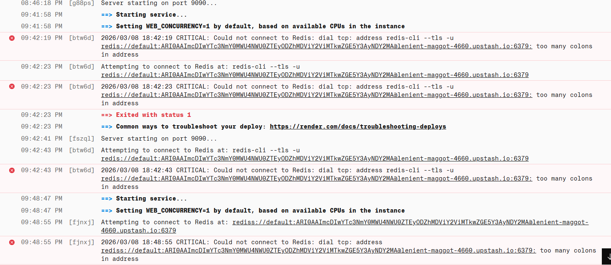
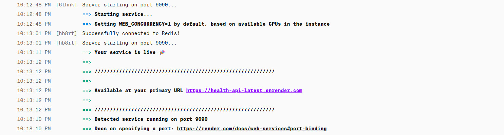
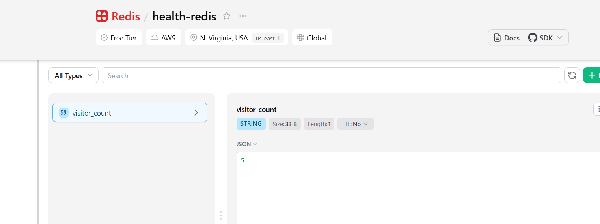

# 🛠 Troubleshooting Log: Redis Connectivity & URI Parsing

**Incident:** Production Service Failure - "Too Many Colons"  
**Date:** March 8, 2026  
**Service:** Go Health-API  
**Stack:** Go (Golang), Docker, Render, Upstash Redis

---

### 1. The Symptom 🚩
Upon deployment to the Render production environment, the service failed to enter a "Healthy" state. Monitoring logs indicated a fatal connection error during the initialization phase, preventing the HTTP server from binding to port 9090.

**Error Signature:**
> `CRITICAL: Could not connect to Redis: dial tcp: address [URL]: too many colons in address`



---

### 2. Root Cause Analysis (RCA) 🔍
The failure was traced to a mismatch between the **Environment Variable configuration** and the **Go-Redis library's expectations**:

1. **Protocol Complexity:** Upstash requires the `rediss://` (TLS) protocol. The standard `redis.Options{Addr: ...}` field expects a raw `host:port` string.
2. **Parsing Failure:** When passing a full URI (containing `scheme`, `password`, and `port`), the library misinterpreted the colons in the protocol and credentials as multiple port delimiters, leading to the "too many colons" error.

---

### 3. The Resolution 🛠️
The fix involved transitioning from manual address assignment to a **URI-aware parser**.

#### B. Implementation of `ParseURL`
By utilizing `redis.ParseURL()`, the application now automatically:
* Extracts the hostname and port correctly.
* Handles the authentication password embedded in the URI.
* Enables TLS/SSL configuration required for secure Upstash connections.



```go
// Implementation Fix
redisURL := os.Getenv("REDIS_ADDR")
opt, err := redis.ParseURL(redisURL)
if err != nil {
    log.Fatalf("CRITICAL: Invalid Redis URL: %v", err)
}
rdb = redis.NewClient(opt)

# 2. Ensure Section 4 looks exactly like this:
### 4. Enhanced Observability & "Fail-Fast" Logic 🛡️
The app now executes `rdb.Ping(ctx)` before starting the HTTP server to ensure the data bridge is solid.


