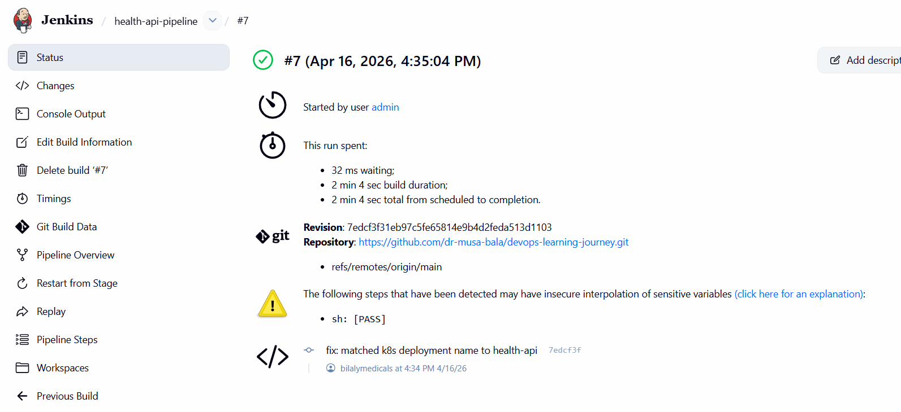
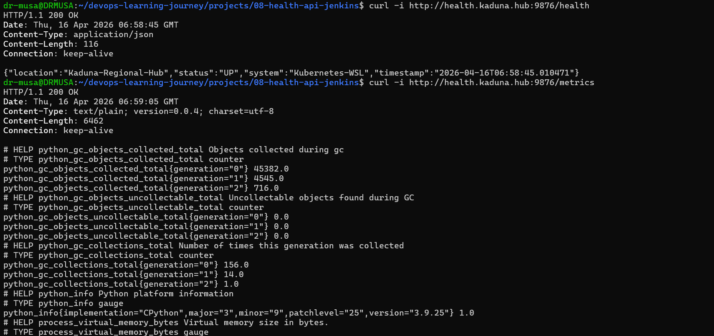

# 📖 Technical Documentation: Project 08 - CI/CD Automation
## Integrated Health API Pipeline for Kaduna Hub Infrastructure

This document provides a deep dive into the implementation of Continuous Integration and Continuous Deployment (CI/CD) for the Health API service. It outlines the architectural decisions, configuration details, and the troubleshooting steps taken to reach a stable automated state.

---

## 1. Executive Summary
The project successfully transitioned the Health API from manual `kubectl` deployments to a fully automated lifecycle. Utilizing Jenkins on a WSL2 backend, we established a pipeline that connects a GitHub source repository to a Minikube Kubernetes cluster via a secure Docker Hub intermediary.

---

## 2. System Architecture
The automation follows a linear progression through four major environments:

1.  **Workstation (WSL2/Ubuntu):** The local development environment where code is written and verified.
2.  **SCM (GitHub):** The source of truth for code and the `Jenkinsfile` pipeline definition.
3.  **Automation Server (Jenkins):** The orchestration engine that executes builds and interacts with external APIs.
4.  **Production Simulation (Minikube):** The final destination where the application runs within the `monitoring` namespace.

---

## 3. The Jenkins Pipeline (Jenkinsfile)
The pipeline is defined as code, ensuring that the deployment process is versioned alongside the application.

### Key Logic & Stages:
* **Dynamic Tagging:** Uses `${env.BUILD_NUMBER}` to ensure image immutability.
* **Directory Context:** Implements `dir()` blocks to navigate the multi-project repository structure.
* **Secure Auth:** Leverages `withCredentials` to mask sensitive Docker Hub tokens.
* **Rolling Updates:** Uses `kubectl set image` to ensure the application remains available during new version rollouts.

---

## 4. Challenges & Resolution Deep-Dive

### A. Networking & Connectivity
* **Issue:** Jenkins web interface showing "Connection Reset" or "Connection Refused."
* **Discovery:** Long uptime in WSL2 led to a networking bridge timeout and a Java process memory spike (1.7GB).
* **Resolution:** System restart (`sudo systemctl restart jenkins`) and port clearing (`fuser -k 8080/tcp`) restored the "Command Center."

### B. Pathing & Contextual Errors
* **Issue:** `ERROR: failed to read dockerfile: open Dockerfile: no such file or directory`.
* **Discovery:** Jenkins runs by default at the repository root. Our project files were nested in `projects/08-health-api-jenkins/`.
* **Resolution:** Modified the `Jenkinsfile` to move into the correct subdirectory before executing `docker build .`.

### C. Resource Identification
* **Issue:** `Error from server (NotFound): deployments.apps "health-app" not found`.
* **Discovery:** The automation script used a generic name (`health-app`), while the live cluster used `health-api`.
* **Resolution:** Executed `kubectl get deployments -A` to map exact names and namespaces, then synchronized the `Jenkinsfile` environment variables to match.

---

## 5. Implementation Log (Step-by-Step)

1.  **Docker Authorization:** Configured `~/.docker/config.json` to bypass credential helper errors in WSL.
2.  **Jenkins Credential Store:** Injected `musabalaaudu` credentials into Jenkins as `docker-hub-creds`.
3.  **GitHub Linkage:** Configured the Jenkins job to track the `main` branch of the `devops-learning-journey` repository.
4.  **Pipeline Execution:** Triggered builds which successfully pushed versioned images to Docker Hub and updated the Kubernetes deployment.

---

## 6. Verification & Post-Build Analysis
After the "Green Build" in Jenkins, the following state was verified:
* **Pod Status:** `kubectl get pods -n monitoring` confirmed new containers were pulled.
* **Image Integrity:** `kubectl describe` showed the new image tag matching the Jenkins build ID.
* **Traffic Flow:** The Ingress controller correctly routed requests to the newly deployed pods via `health.kaduna.hub`.

---
**Status:** Completed & Automated
**Author:** Musa (DevOps & Production Support Engineer)


## 🚥 Verification & Results

After the pipeline completes, the successful automation is verified through the Jenkins build status and the live API responses.

### 1. Automated CI/CD Execution
The pipeline successfully automates the build, push, and deployment phases. Below is the confirmation of the green build in Jenkins.


*Figure 1: Jenkins Dashboard showing the successful completion of the Health API pipeline.*

### 2. Live API Service Verification
Once deployed, we verify the application's health and the Prometheus metrics integration through the Ingress controller.


*Figure 2: Terminal output verifying successful curl responses for /health and /metrics endpoints.*

---

## 🚦 Post-Deployment Commands
To verify the deployment version manually in your terminal:
```bash
# Confirm the image version matches the Jenkins build number
kubectl describe deployment health-api -n monitoring | grep Image

# Test the endpoints via the Kaduna Hub domain
curl -I [http://health.kaduna.hub/health](http://health.kaduna.hub/health)
curl -I [http://health.kaduna.hub/metrics](http://health.kaduna.hub/metrics)
