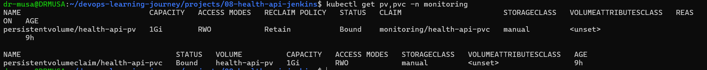

## 📄 Infrastructure Documentation: Persistence & Auto-Scaling
**Project:** Health-API (Phase 4 & 5)  
**Environment:** Minikube (Development/Testing)  
**Namespace:** `monitoring`

---

### 1. Stateful Storage (Persistent Volumes)
To transition the Health-API from a "stateless" app to a "stateful" one, we implemented a decoupled storage architecture. This ensures that logs, audit trails, and local data survive pod restarts or deployments.

#### **Architecture Components:**
* **PersistentVolume (PV):** A cluster-wide resource representing a 1Gi segment of the host machine's disk (`/mnt/data`).
* **PersistentVolumeClaim (PVC):** A request by the application for a specific amount of storage (1Gi) with `ReadWriteOnce` access.
* **Volume Mount:** The internal mapping that connects the PVC to the container's `/app/data` directory.


#### **Challenges & Resolutions:**
| Challenge | Root Cause | Resolution |
| :--- | :--- | :--- |
| **ImagePullBackOff** | Using `:latest` tag triggered an external pull from Docker Hub, which failed because the image only existed in the local Minikube registry. | Updated `k8s_deployment.yaml` to use a specific, immutable build tag (`health-api:31`) and set `imagePullPolicy: IfNotPresent`. |
| **Stuck Deployment** | Kubernetes was trying to perform a Rolling Update but could not start the new Pod due to the image error. | Manually deleted the failing Pod and updated the Deployment manifest to clear the "stuck" state. |
| **Data Verification** | Uncertainty if the storage was actually persistent across Pod lifecycles. | Performed a "Chaos Test": Created a file in the Pod, deleted the Pod, and verified the file existed in the newly spawned replacement Pod. |

### 💾 Data Persistence
The Health-API uses a Persistent Volume Claim (PVC) to ensure data survives pod restarts. 


*Figure 1: Verification of the PVC successfully binding to the PV.*
---

### 2. Elastic Scaling (Horizontal Pod Autoscaler - HPA)
To handle traffic spikes in the **Kaduna Hub** and ensure high availability, we moved from static replicas to dynamic scaling.

#### **Configuration Details:**
* **Minimum Replicas:** 2 (Ensures zero-downtime during updates).
* **Maximum Replicas:** 5 (Prevents resource exhaustion on the host).
* **Scaling Trigger:** 50% average CPU utilization.


#### **Operational Logic:**
1.  **Metrics Collection:** The HPA queries the `metrics-server` every 15 seconds.
2.  **Calculation:** If `CurrentCPU > 50%`, the HPA calculates the required replicas using the formula:
    $$DesiredReplicas = \lceil CurrentReplicas \times \frac{CurrentMetricValue}{TargetValue} \rceil$$
3.  **Cooldown (Stabilization):** To prevent "flapping" (scaling up and down too rapidly), Kubernetes waits for a stabilization window (usually 5 minutes) before scaling back down.

---

### 3. Benefits to the Team
* **Operational Resilience:** The app now self-heals without losing data.
* **Cost & Resource Efficiency:** We only use the compute power we need, scaling down during low-traffic periods in the Kaduna region.
* **Immutable Deployments:** By switching from `:latest` to specific tags (e.g., `:31`), the support team can rollback to a known working state instantly if a bug is discovered.

---

### 🛠️ Final Infrastructure State Check
To view the current "Health" of this documentation's implementation, run:
```bash
# Check all resources in the namespace
kubectl get all,pv,pvc,hpa -n monitoring
```
### 📈 Horizontal Pod Autoscaling (HPA)
We implemented HPA to manage traffic spikes. The system automatically scales between 2 and 5 replicas based on a 50% CPU threshold.


*Figure 2: HPA monitoring the live CPU load of the Kaduna Hub.*
